# Bike Sharing in Des Moines, IOMA

### **Objectives**

The objective of this project is to create a story using **Tableau**, a business intelligence software. The focus of the project is on making a proposition for opening a bikeshare business in Des Moines, Iowa. The idea of the business came from the experience of riding  bikes to different landmarks of crowded New York City during a trip. The bikes were from _Citi Bikes_, a bikeshare program available for tourists and locals to commute to different parts of the city. The project is to make a presentation for an investor who may be interested in giving the seed money for the Des Moines bikeshare project. We used Tableau to make a presentation (a proposal) to explore the possibilities of the bikeshare program. The city of Des Moines is very different in population, business structure, roads, and attractions from New York City. We focused on a few aspects of the New York bike share program: the age, gender, the start and the end locations, trip duration. We also looked at the _Subscribers_ (annual subscribers) vs _Customers_ (short term riders) in New York City. We looked at the historical data collected by the New York Citi Bike on August, 2018. August is a popular month for outdoor activities that would attract more bike renting customers. 

### **Analysis and Results**

We used **_Tableau Public_** to make the Worksheets, Dashboard and Story. We focused on New York City _Citi Bikes_ , a bikeshare program that allows people to commute around the city. The <a href='https://s3.amazonaws.com/tripdata/index.html'> _Citi Bikes_ database </a>is large. We downloaded the August 2018 trip history data from the Citi Bike website. We emphasized on the gender and age factors of the Subscribers/Customers for the Deliverables of this project. The data file has 2,344,224 records of _tripduration_, _start time_, _stop time_, _station id_, start and end station location by latitude and longitude, _bike id_, _birth year_ and _Gender_.

#### **Deliverable 1: Change Trip Duration to a Datetime Format**

We changed the data type of the _tripduration_ from an _integer_ to _datetype_ to get hours, minutes and seconds using Python and Pandas. After importing the csv datafile, *201908-citibike-tripdata.csv* and creating a DataFrame in Jupyter notebook, we used *to_datefime()* function to convert the data. Fig 1 and 2 below shows the before and after images of the DataFrame. I used the command:
*pd.to_datetime(dataFile_df['tripduration'], unit='s')*

 The Unix timestamp, Jan 01, 1970, is automatically added to the conversion. Note that this is not going to be a problem in our Tableau data visualization, since we are only interested in the hours, minutes, and seconds. We can filter out the year. 
 The converted data is saved in a new csv file. 

 _**Please note - The data files are too large to export to GitHub. I removed the original csv data file and the converted csv data file from the _bikeshare_ repository.**_
 

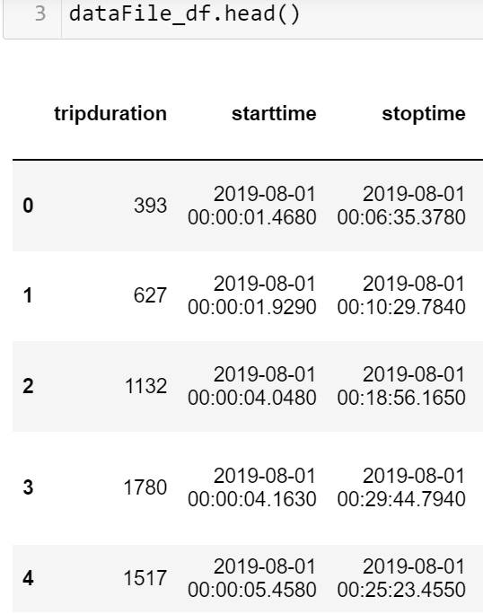 

**Fig 1:** The DataFrame before making any change showing tripduration in integer seconds. 

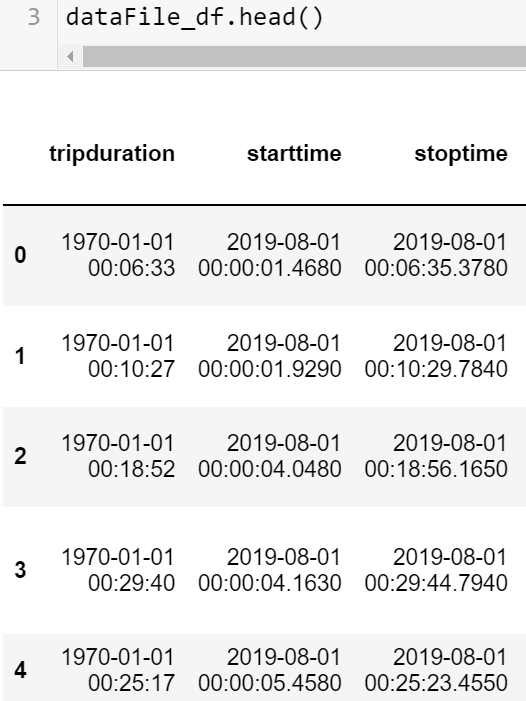

**Fig 2:** The DataFrame after converting the tripduration in datetime format. The year is the Unix timestamp of January 01, 1970. 

#### **Deleverable 2: Visualization for the Trip Analysis**

We created five visualizations in Tableau Worksheets. The focus is on

- The length of time the bikes are checked out for all riders and gender.

- The number of trips taken by the hour of each day of the week for all riders and genders.

- A breakdown on the days of the week a user might be more likely to check out a bike, by user and gender.

Figs 3 - 7  below shows the images of the five different Tableau worksheets generated for this deliverable.  The Tableau links for the story is given under the section _**Tableau Link**_. The images of the other worksheets is given below. There are few items we need to consider when we view the data and make conclusion. 
- The "Unknown" gender are irrelevant when we do the gender study. The "Unknown" gender data is useful in studying the total number of bikes utilized. 

- The birthyears seems to have  incorrect information. People who were born on 1890 are most likely dead and cannot rent a bike in 2018. 

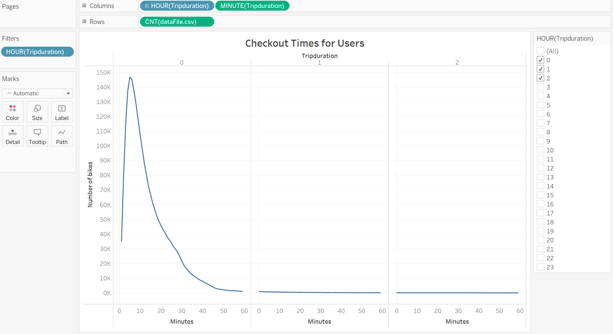

 **Fig 3:** The image shows **Checkout Times for Users**. Most of the bikes are checked out for lesss than an hour. 

 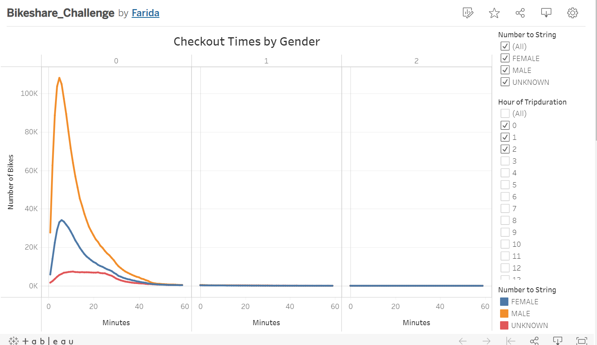

 **Fig 4:** The image shows **Checkout Times by Gender**.  It appears that male customers are more active in riding bike around New York City. 
 
 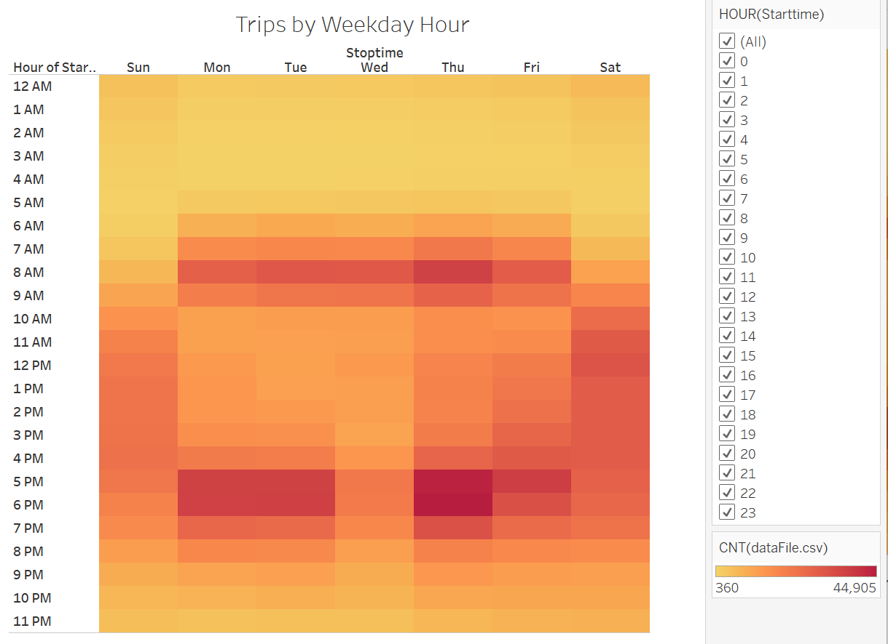

**Fig 5:** This heatmap image shows the trips by weekday for each hour. More bikes are checked out at the beginning  and at the end of the workday. Least active time is between midnight and 5 am. This would be a good time to do the maintenance of the bikes. 

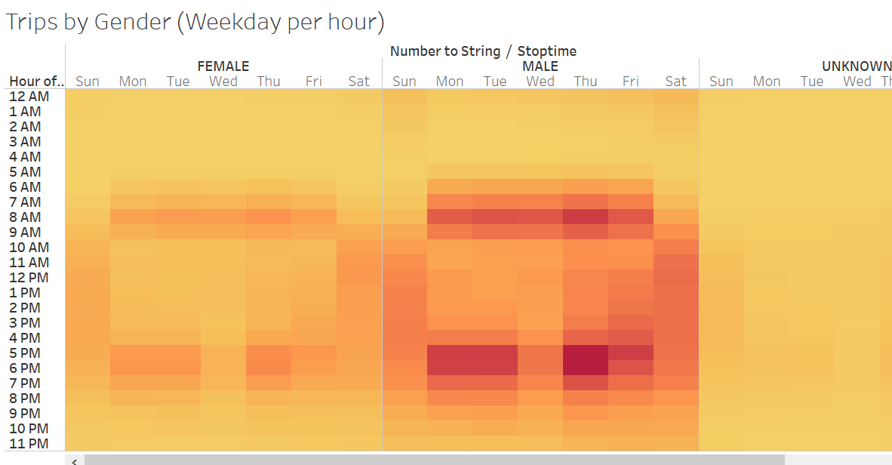

**Fig 6:** The heatmap above shows the image of the trips by gender of the biker. Most of the customers are male and they use the bikes on weekdays, most likely commuting to their work. Both male and female bikers rent bike during the rush hour  on weekdays. There seems to be more renting between 9:00 am - 7:00 pm on weekends for all the genders. The unknown genders are renting more the bikes on weekends, which implies that these customers rent the bike for recreation and sightseeing. Bike activities of the "unknown" genders during the weekdays is minimum. 

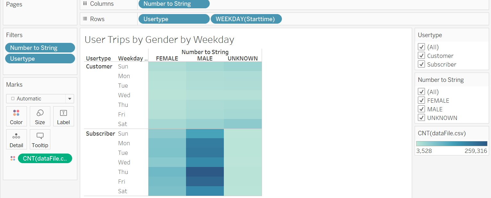

**Fig 7:** The image shows a heatmap of the bike activities by gender, by customer type by weekdays. Consistent with the other data, more bikers are male. There are more subscribers than customers. This is good for the bikeshare company, _Citi Bike_ since long terms subscribers are reliable revenue generators. 

### **Conclusion**

The final part of the project is to make a story in Tableau that can be used as a presentation for a potential investor to invest in the bikeshare company in Des Moines, Iowa. We need to consider some of the following aspects before we can open a new business.

- **What makes sense in having a bikeshare company in New York** - New York City is a densely populated city that is too crowded and expensive for workers to use cars for their daily commute around the city. People may need to go to various parts of the city after parking their car in a garage or a parking lot. It is inconvinient and expensive to take personal vehicle out for a short time. Getting a taxi or Uber will likely add up as costly in the long run. New York also has a large public transportation system. However, it is convenient for many people to use bikes for a short distance commute, rather than wait for a bus or train. We see that there is large younger generation (between 18 - 40 years) riding bikes on weekdays. This seems to agree with my earlier observation that riding bike is convenient mode of transportation to job that is a short commute to and around the city buildings. _Citi Bike_ also has several parking places throughout the city, which makes parking the bike at the end of the trip convenient. The data we used has some inconsistencies, such as people born as early as 1890 renting bikes. However, those numbers are small and hence it does not skew the results. We also had "unknown" gender renting bikes. These are perhaps customers who do not want to share all the information for privacy concern. Judging from the trend of these customer renting bike on weekends, it appears that these "unkown gender" customers are sightseeing as they ride bikes.

- **Why a bikeshare company Des Moines, Iowa may work** - Des Moines is a growing city. The city is not as densely populated as New York City. However, every city is growing and is trying to attract younger generation workforce. Carbon footprint is a concern for younger people (age 20 - 45 years) and they are more likely going to be interested in riding bike around for short rides in the metropolitan area. It is necessary to do more study, such as how profitable are the existing bikeshare companies, such as _BCycle_. We also need to study the growth of companies in the metropolitan area. Giving incentive for bike sharing subscription would make a good business strategy since that would generate a steady revenue.  It is also important to look a the data collected for other months. While, August may generate most revenues because of outdoors acitivities, a business needs to generate a decent amount of revenue during other months to survive. 

#### **Deliverable 3**

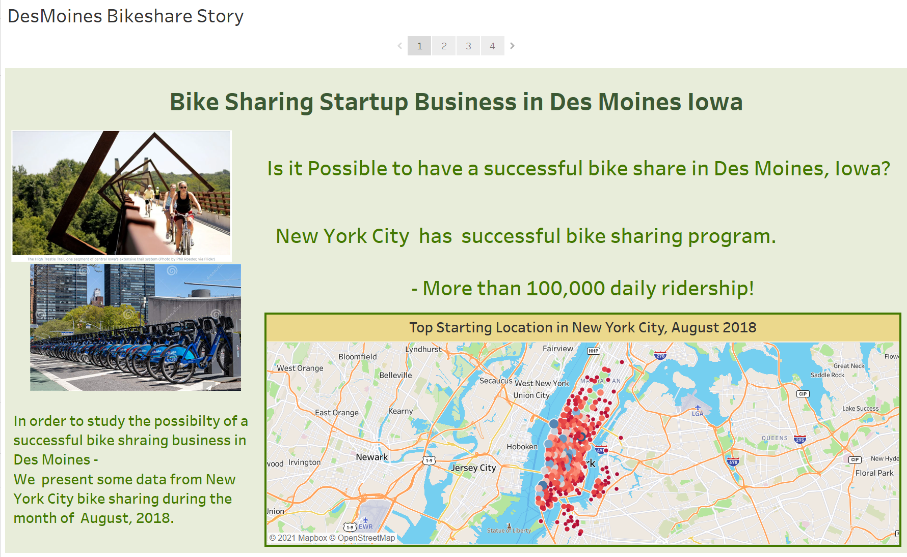
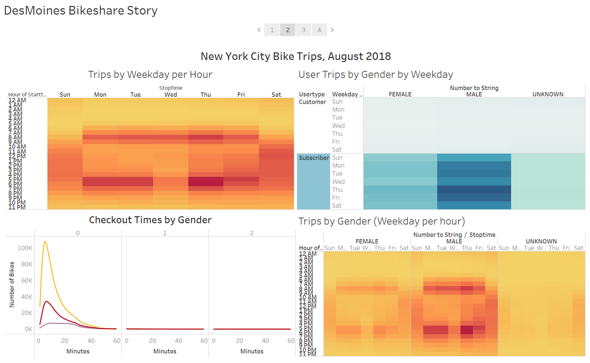

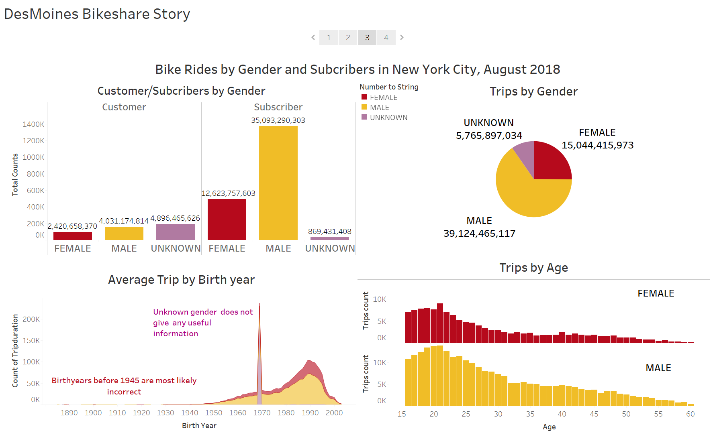
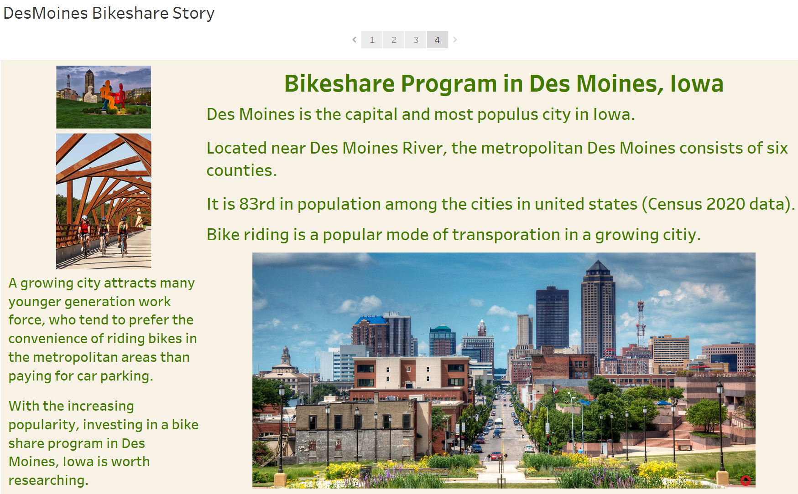

**Fig 8:**  The figures above show the images of the Tableau story I created for Deliverable 3. I focused on bike renting by age, gender, and subscription. I created an age data column by subtracting the birthyear from the year 2018. It turns out that the age data is corrupted since it states that some people 135 year old were renting bike in the year 2018. I filtered out the more than 60 years old customers since older people will be less likely riding bike around the city due to health concern. I also removed the "UNKOWN" gender data since it does not give much information about the target customers. 

### **Tableau Story Link :**
- Fig 8: <a href = "https://public.tableau.com/app/profile/farida4537/viz/Bikeshare_Challenge_16330731483620/DesMoinesBikeshareStory?publish=yes"> The Des Moines Bikeshare Story</a>